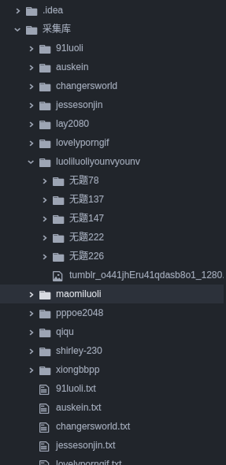

# 基于python3 的tumblr爬虫

功能介绍：自动下载tumblr博客上的图片，以及将视频链接收集以博客id的名字保存为txt文档

如果可以点个star再走呗！#0

### 需要的第三方模块

```
import requests
```
### 使用方法

```
- git clone git@github.com:strugglerx/tumblrWorm
- cd tumblrWorm
- python3 tumblrWorm.py blogID1 blogID2 ..
```
*tumblrWorm.py 后的blogID1参数最少为一个*

*blogID是 xxxx.tumlr.com里的xxxx*

*一个blogId对应一个线程，所以放心大胆的输入参数吧！*

### 配置文件说明

./worm.conf

```
{"start":0,"count":100}
```
count对象为爬取的信息数量，默认爬取100条数据

### 爬取目录结构


---

### 联系方式：
**我的公众号：**


-------（wx-struggler）-------

**个人微信：**
（strongdreams）期待我们有共同语言！
